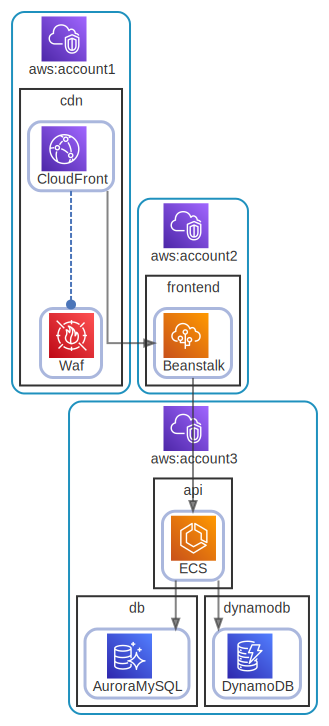

# aws

  [ <a href="../../ndiag.descriptions/_layer-aws.md">:pencil2: Edit description</a> ]

## aws:account1

  [ <a href="../../ndiag.descriptions/_cluster-aws_account1.md">:pencil2: Edit description</a> ]

### Nodes

| Name | Description |
| --- | --- |
| [cdn](node-cdn.md) | <a href="../../ndiag.descriptions/_node-cdn.md">:pencil2:</a> |
## aws:account2

  [ <a href="../../ndiag.descriptions/_cluster-aws_account2.md">:pencil2: Edit description</a> ]

### Nodes

| Name | Description |
| --- | --- |
| [frontend](node-frontend.md) | <a href="../../ndiag.descriptions/_node-frontend.md">:pencil2:</a> |
## aws:account3

  [ <a href="../../ndiag.descriptions/_cluster-aws_account3.md">:pencil2: Edit description</a> ]

### Nodes

| Name | Description |
| --- | --- |
| [api](node-api.md) | <a href="../../ndiag.descriptions/_node-api.md">:pencil2:</a> |
| [db](node-db.md) | <a href="../../ndiag.descriptions/_node-db.md">:pencil2:</a> |
| [dynamodb](node-dynamodb.md) | <a href="../../ndiag.descriptions/_node-dynamodb.md">:pencil2:</a> |

---

> Generated by [ndiag](https://github.com/k1LoW/ndiag)
