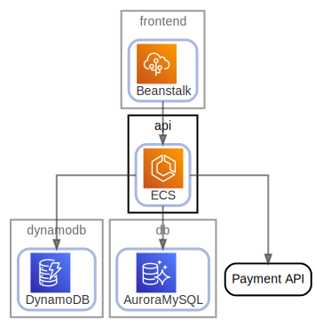

# api

  [ <a href="../../ndiag.descriptions/_node-api.md">:pencil2: Edit description</a> ]

## Components

| Name | Description | From (Relation) | To (Relation) |
| --- | --- | --- | --- |
| api:ecs |  <a href="../../ndiag.descriptions/_component-api_ecs.md">:pencil2:</a> | [frontend:beanstalk](node-frontend.md) | [dynamodb:dynamodb](node-dynamodb.md) / [db:auroramysql](node-db.md) / payment api |

## Labels

| Name | Description |
| --- | --- |

---

> Generated by [ndiag](https://github.com/k1LoW/ndiag)
