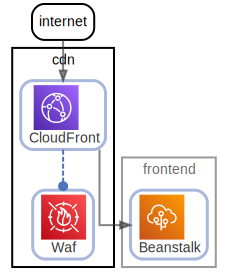

# cdn

  [ <a href="../../ndiag.descriptions/_node-cdn.md">:pencil2: Edit description</a> ]

## Components

| Name | Description | From (Relation) | To (Relation) |
| --- | --- | --- | --- |
| cdn:cloudfront |  <a href="../../ndiag.descriptions/_component-cdn_cloudfront.md">:pencil2:</a> | internet | [frontend:beanstalk](node-frontend.md) / [cdn:waf](node-cdn.md) |
| cdn:waf |  <a href="../../ndiag.descriptions/_component-cdn_waf.md">:pencil2:</a> | [cdn:cloudfront](node-cdn.md) |  |

## Labels

| Name | Description |
| --- | --- |

---

> Generated by [ndiag](https://github.com/k1LoW/ndiag)
