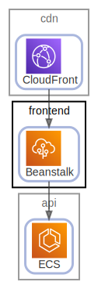

# frontend

  [ <a href="../../ndiag.descriptions/_node-frontend.md">:pencil2: Edit description</a> ]

## Components

| Name | Description | From (Relation) | To (Relation) |
| --- | --- | --- | --- |
| frontend:beanstalk |  <a href="../../ndiag.descriptions/_component-frontend_beanstalk.md">:pencil2:</a> | [cdn:cloudfront](node-cdn.md) | [api:ecs](node-api.md) |

## Labels

| Name | Description |
| --- | --- |

---

> Generated by [ndiag](https://github.com/k1LoW/ndiag)
