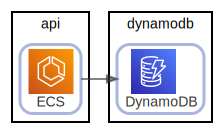
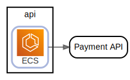
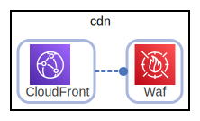

# overview

  [ <a href="../../ndiag.descriptions/_view-overview.md">:pencil2: Edit description</a> ]

## Nodes

| Name | Description |
| --- | --- |
| [cdn](node-cdn.md) | <a href="../../ndiag.descriptions/_node-cdn.md">:pencil2:</a> |
| [frontend](node-frontend.md) | <a href="../../ndiag.descriptions/_node-frontend.md">:pencil2:</a> |
| [api](node-api.md) | <a href="../../ndiag.descriptions/_node-api.md">:pencil2:</a> |
| [db](node-db.md) | <a href="../../ndiag.descriptions/_node-db.md">:pencil2:</a> |
| [dynamodb](node-dynamodb.md) | <a href="../../ndiag.descriptions/_node-dynamodb.md">:pencil2:</a> |

## Relations

##### `internet-a824a5b`

  [ <a href="../../ndiag.descriptions/_relation-internet-a824a5b.md">:pencil2: Edit description</a> ]

| # | Component | Description |
| --- | --- | --- |
| 0 | internet |  <a href="../../ndiag.descriptions/_component-internet.md">:pencil2:</a> |
| 1 | cdn:cloudfront |  <a href="../../ndiag.descriptions/_component-cdn_cloudfront.md">:pencil2:</a> |

---

##### `cdn:cloudfront-2f54199`

  [ <a href="../../ndiag.descriptions/_relation-cdn_cloudfront-2f54199.md">:pencil2: Edit description</a> ]

| # | Component | Description |
| --- | --- | --- |
| 0 | cdn:cloudfront |  <a href="../../ndiag.descriptions/_component-cdn_cloudfront.md">:pencil2:</a> |
| 1 | frontend:beanstalk |  <a href="../../ndiag.descriptions/_component-frontend_beanstalk.md">:pencil2:</a> |

---

##### `frontend:beanstalk-d711197`

  [ <a href="../../ndiag.descriptions/_relation-frontend_beanstalk-d711197.md">:pencil2: Edit description</a> ]

| # | Component | Description |
| --- | --- | --- |
| 0 | frontend:beanstalk |  <a href="../../ndiag.descriptions/_component-frontend_beanstalk.md">:pencil2:</a> |
| 1 | api:ecs |  <a href="../../ndiag.descriptions/_component-api_ecs.md">:pencil2:</a> |

---

##### `api:ecs-5784425`

  [ <a href="../../ndiag.descriptions/_relation-api_ecs-5784425.md">:pencil2: Edit description</a> ]

| # | Component | Description |
| --- | --- | --- |
| 0 | api:ecs |  <a href="../../ndiag.descriptions/_component-api_ecs.md">:pencil2:</a> |
| 1 | dynamodb:dynamodb |  <a href="../../ndiag.descriptions/_component-dynamodb_dynamodb.md">:pencil2:</a> |

---

##### `api:ecs-cb43e77`

  [ <a href="../../ndiag.descriptions/_relation-api_ecs-cb43e77.md">:pencil2: Edit description</a> ]

| # | Component | Description |
| --- | --- | --- |
| 0 | api:ecs |  <a href="../../ndiag.descriptions/_component-api_ecs.md">:pencil2:</a> |
| 1 | db:auroramysql |  <a href="../../ndiag.descriptions/_component-db_auroramysql.md">:pencil2:</a> |

---

##### `api:ecs-8a4b54d`

  [ <a href="../../ndiag.descriptions/_relation-api_ecs-8a4b54d.md">:pencil2: Edit description</a> ]

| # | Component | Description |
| --- | --- | --- |
| 0 | api:ecs |  <a href="../../ndiag.descriptions/_component-api_ecs.md">:pencil2:</a> |
| 1 | payment api |  <a href="../../ndiag.descriptions/_component-payment_api.md">:pencil2:</a> |

---

##### `cdn:cloudfront-1112abc`

  [ <a href="../../ndiag.descriptions/_relation-cdn_cloudfront-1112abc.md">:pencil2: Edit description</a> ]

| # | Component | Description |
| --- | --- | --- |
| 0 | cdn:cloudfront |  <a href="../../ndiag.descriptions/_component-cdn_cloudfront.md">:pencil2:</a> |
| 1 | cdn:waf |  <a href="../../ndiag.descriptions/_component-cdn_waf.md">:pencil2:</a> |

---
## Layers

| Name | Description |
| --- | --- |

## Labels

| Name | Description |
| --- | --- |

---

> Generated by [ndiag](https://github.com/k1LoW/ndiag)
